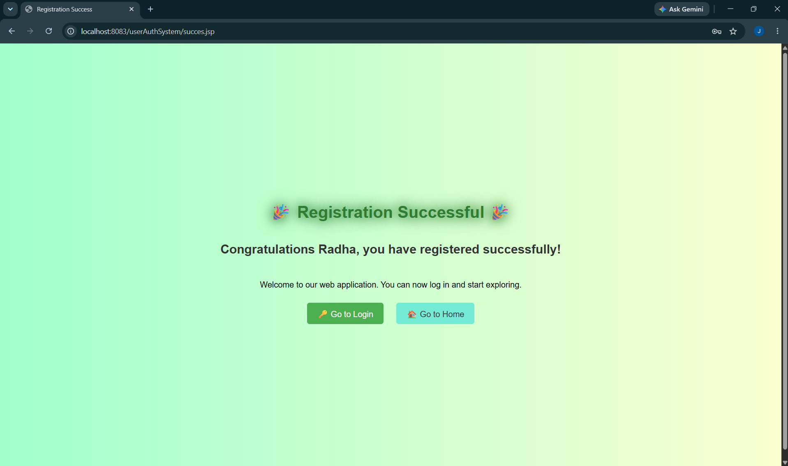
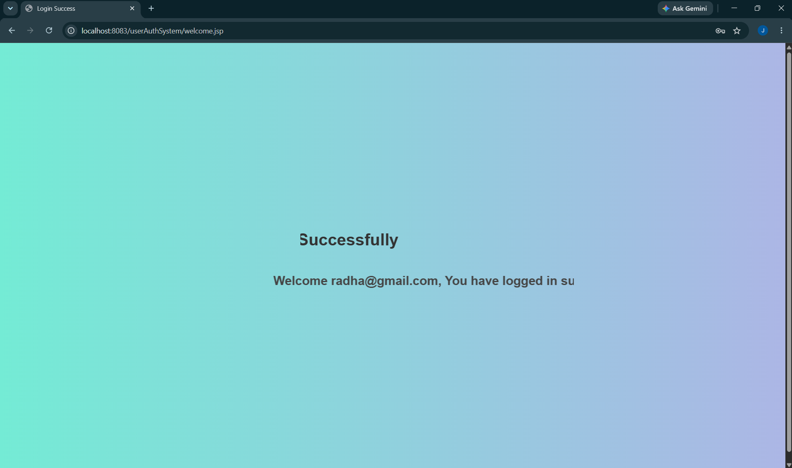

# UserAuthSystem

A simple Java Servlet + JSP based user authentication system built using Eclipse and Tomcat.

This project demonstrates user registration, secure login with BCrypt password hashing, 
session management and interactive JSP pages with success/failure handling.

---

## 🚀 Features
- User Registration with MySQL database integration
- User Login with credential validation
- Session Management (login/logout)
- Interactive JSP pages for success and failure
- MVC architecture (Servlets + JSP + Model classes)

---

## 🛠 Tech Stack
- **Java (Servlets & JSP)**
- **Eclipse IDE**
- **Apache Tomcat**
- **MySQL Database**
- **HTML/CSS** for front‑end

---

## 📂 Project Structure
UserAuthSystem/
├── src/                # Java source files (Servlets, Models)
├── WebContent/         # JSP pages, HTML, CSS
├── WEB-INF/            # web.xml configuration
├── README.md           # Project documentation
└── .gitignore          # Ignored files


---

## ⚙️ Setup Instructions
1. Clone the repository:
   ```bash
   git clone https://github.com/jaiganesh0517/UserAuthSystem.git
2. Import into Eclipse IDE as a Dynamic Web Project.
3. Configure Apache Tomcat server in Eclipse.
4. Setup MySQL database:
   CREATE DATABASE userdb;
USE userdb;

CREATE TABLE personalinfo (
    id INT AUTO_INCREMENT PRIMARY KEY,
    Name VARCHAR(100),
    EmailId VARCHAR(100) UNIQUE,
    Password VARCHAR(100)
);
5. Update DB connection details in your Model class.
6. Run the project → open in browser:
   http://localhost:8080/UserAuthSystem/


## 📸 Screenshots

### Registration Success


### Login Failure



🔒 Future Improvements

 * Client‑side validation with JavaScript

 * Responsive UI with Bootstrap

 * Role‑based authentication (Admin/User)

👨‍💻 Author
Jaiganesh  
GitHub Profile ((https://github.com/jaiganesh0517))
